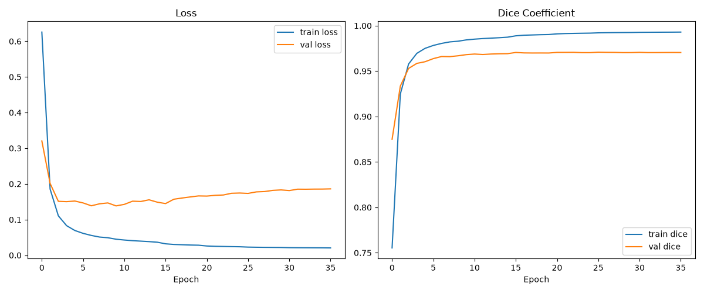
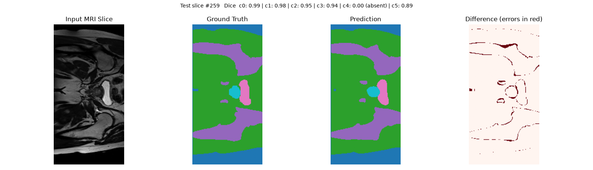
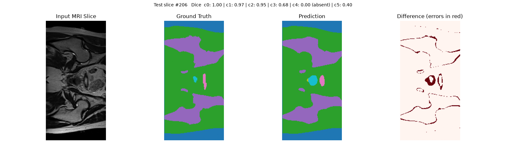
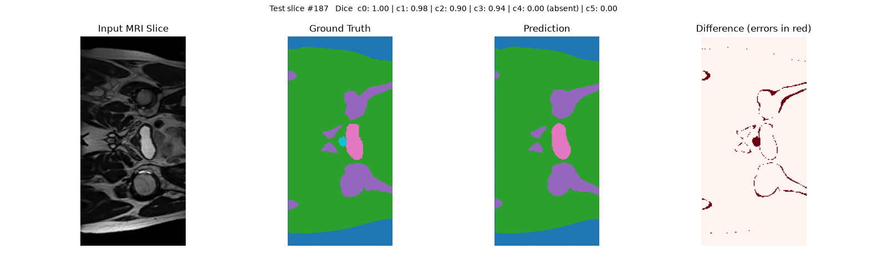
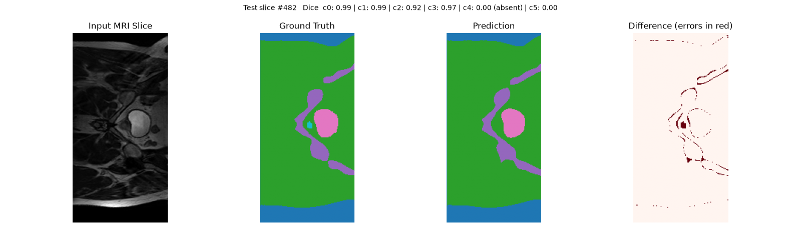
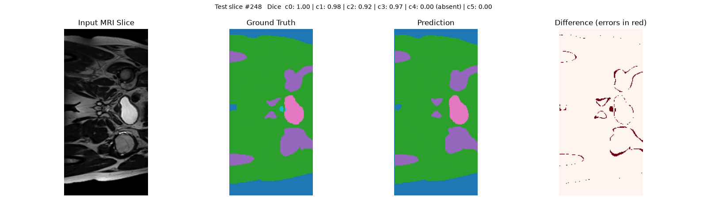
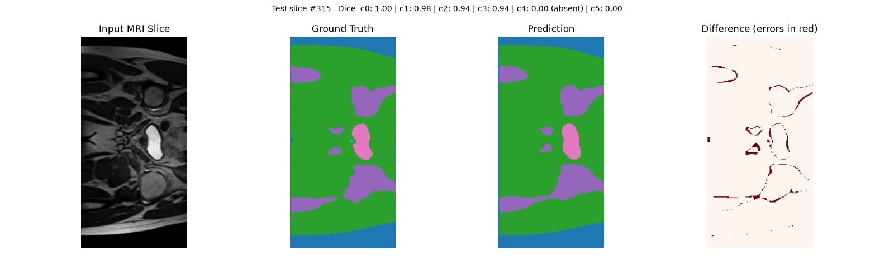
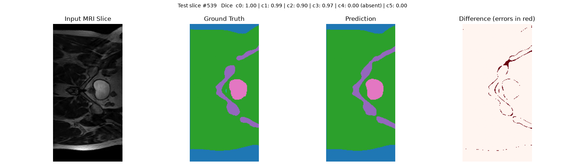

# HipMRI Prostate Segmentation

*COMP3710 Pattern Recognition Report — Marcus Wee Lam Seow, s48747240*

## Project Description
Radiotherapy planning needs accurate contours of the prostate and nearby organs. This project segments 2D pelvic MRI slices from the HipMRI study into six labels (label 0 plus five anatomical structures) using a standard 2D U-Net (Ronneberger et al., 2015), and compares it against a reduced baseline U-Net on the same data. The task target is Dice >= 0.75 on the prostate label on the test set. [CHECK: confirm the label-to-structure mapping with your tutor. The spec lists body outline, bone, bladder, rectum and prostate, which suggests 1 = body, 2 = bone, 3 = bladder, 4 = rectum, 5 = prostate, but this is unverified, so results are reported by class number.]

**How it works.** The U-Net has a four-level encoder (32, 64, 128, 256 filters) with a 512-filter bottleneck, a symmetric decoder using transposed convolutions and skip connections, batch normalisation, and a 6-channel softmax output (7.77M parameters). It is trained with Dice loss + categorical cross-entropy, Adam (lr 1e-4, reduced on plateau), early stopping and best-checkpoint saving on validation Dice. The baseline has the same architecture with half the filters (16 base) and no batch normalisation (1.94M parameters). Both use identical data, loss and optimiser settings and are evaluated on the same 540 test slices.



## Data Use & Acknowledgments

This project uses data from the **HipMRI Study**, accessed via the
University of Queensland's Rangpur HPC cluster
(`/home/groups/comp3710/HipMRI_Study_open/`), under the terms of the
HipMRI Study data use agreement.

**Acknowledgments:** Data were provided in part by the HipMRI Study.

**Citation:** The specific HipMRI Study publication appropriate for
*image segmentation* use is not specified in the data use agreement
provided with the dataset (the citation field is left blank in
`data_use_agreement.txt`). This has been raised with the teaching team
for clarification; this section will be updated once confirmed. In the
interim, the following HipMRI Study publications (explicitly listed in
the data use agreement) are cited, as the closest applicable references
for work derived from this dataset:

- HipMRI Study for MRI-alone treatment planning and other imaging:
  https://doi.org/10.1016/j.ijrobp.2015.08.045
- HipMRI Study for image synthesis and translation:
  https://arxiv.org/abs/2011.13615
- HipMRI Study for image segmentation: *[citation pending — confirm with
  teaching team; agreement document leaves this reference blank]*

**Data use terms acknowledged:**
- No attempt has been made to identify or contact any study participant.
- This dataset and any derived results are used for non-commercial,
  coursework purposes only.
- No warranty is made or implied regarding the correctness of the
  provided data.

## Dependencies and Reproducibility
Python 3.11 (conda env `tf`), tensorflow 2.21.0, nibabel 5.4.2, numpy 2.4.6, matplotlib 3.11.2, tqdm 4.70.1. Run on one NVIDIA A100 40 GB on Rangpur, partition `comp3710`, with no `--mem` request (the nodes reject one).

```bash
sbatch train_job.sh               # main U-Net -> checkpoints/unet2d_best.keras
sbatch train_baseline_job.sh      # baseline   -> checkpoints/baseline2d_best.keras
sbatch predict_job.sh             # figures in predictions/
sbatch predict_baseline_job.sh    # figures in predictions_baseline/
```

The training shuffle uses seed 42, but no global random seed is set and GPU kernels are nondeterministic, so reruns give slightly different numbers (repeat evaluation of one checkpoint changed Dice in the fourth decimal place). Checkpoints are not committed.

| File | Purpose |
|---|---|
| `modules.py` | U-Net, reduced baseline, Dice metric and loss |
| `dataset.py` | Loading, size standardisation, normalisation, one-hot encoding, leakage check, augmentation |
| `train.py` | Training, validation, test evaluation, curves, resource profiling |
| `predict.py` | Per-class evaluation and failure-case figures |

## Data Pipeline
Data: `/home/groups/comp3710/HipMRI_Study_open/keras_slices_data` on Rangpur (not committed). Slices are NIfTI files named `case_<id>_week_<n>_slice_<n>.nii.gz` with matching `seg_...` masks.

- **Splits.** The course provides fixed train, validate and test folders (11,460 / 660 / 540 slices), so I did not re-split. `check_no_leakage` in `dataset.py` verifies that no case id appears in more than one split, and it raised no error. [CHECK: confirm a case id is one patient; if so this is a patient-level split.] The validation split drives early stopping and checkpoint selection; the test split is used only for final evaluation.
- **Size standardisation.** Slices vary in size (e.g. 256x128 and 256x144), so each is centre-cropped or zero-padded to 256x128.
- **Intensity normalisation.** Each image slice is z-scored. This is simple but discards absolute intensity information.
- **Labels.** Masks are one-hot encoded against a fixed class count of 6. An earlier version inferred the class count per slice, which gave inconsistent channel counts when a label was missing; this was fixed.
- **Augmentation.** Random horizontal flip on the training split only. Validation and test are neither augmented nor shuffled, so test slice indices match the sorted file order.

## Feasibility Review
[CHECK: replace with the one-page review you actually presented at the midpoint check-off. The draft below must match what you presented and measured.]

- **User and acceptance criteria.** User: a clinician reviewing draft contours. Criteria: (1) prostate Dice >= 0.75 on the test set; (2) per-class Dice reported over slices where the class exists; (3) 3 to 5 failure cases diagnosed; (4) a full training run under 1 GPU-hour on one A100.
- **Model and course concepts.** A 2D U-Net on `keras_slices_data` (Easy tier), chosen to verify the pipeline first.
- **Preliminary evidence.** `check_label_classes.py` confirmed six label values; a smoke test confirmed GPU training at about 30 ms/step.
- **Risks and fallback.** Class imbalance, slice-size variation, cluster node and memory problems. Fallback: reduced-size model and shorter schedule.

## Experiments and Results
All numbers are from one training run per model. [CHECK: add epochs run and training time for each model from the `train_*.out` logs.]

### Per-class Dice (test set, 540 slices)

Classes 3, 4 and 5 are absent from some slices, and Dice for an absent class is about 0 if the model predicts any pixels of it, so the "where present" column is the meaningful one.

| Class | Main U-Net (where present) | Baseline (where present) | Present in |
|---|---|---|---|
| 0 | 0.996 | 0.995 | 540/540 |
| 1 | 0.983 | 0.978 | 540/540 |
| 2 | 0.912 | 0.884 | 540/540 |
| 3 | 0.923 | 0.909 | 401/540 |
| 4 | 0.764 | 0.647 | 220/540 |
| 5 | 0.694 | 0.699 | 195/540 |

Prostate target (>= 0.75): [CHECK: if class 5 is the prostate, the main U-Net reaches 0.69 and the target is **not met**; if class 4, it reaches 0.76 and is met.]

The larger U-Net clearly helps on class 4 (+0.12) and slightly on class 2 (+0.03). On class 5 the two models are tied (0.694 vs 0.699); with single runs I make no claim either way. The global Keras Dice (about 0.97) is dominated by background and is not comparable to this table.

### Resource profile

| | Main U-Net | Baseline |
|---|---|---|
| Parameters | 7,771,462 | 1,940,902 |
| Peak GPU memory (training process) | 17.29 GB* | 13.39 GB |
| Inference | 48.4 ms/slice* | 29.9 ms/slice |
| Training step time | about 30 ms | about 17 ms |

*Measured on a second training run of the same architecture, not on the checkpoint evaluated above. Peak memory includes the in-memory data pipeline and XLA workspace, so it overstates the model's own footprint.

### Failure case autopsy (main U-Net)

`predict.py` scores all 540 test slices, targets the weakest class (class 5), and visualises seven slices: the five worst (ties at Dice 0.00 broken by missed area, picks at least 10 indices apart), the median-Dice success (Dice >= 0.8), and the slice closest to Dice 0.4. Figures show input, ground truth, prediction and a difference overlay. Colours are fixed: blue = class 0, green = 1, purple = 2, pink = 3, cyan = 5.

| Slice | Role | Class 5 Dice | Class 5 GT pixels |
|---|---|---|---|
| 259 | Success | 0.89 | 384 |
| 206 | Partial overlap | 0.40 | 85 |
| 187 | Complete miss | 0.00 | 98 |
| 482 | Complete miss | 0.00 | 55 |
| 248 | Complete miss | 0.00 | 54 |
| 315 | Complete miss | 0.00 | 9 |
| 539 | Complete miss | 0.00 | 8 |









**Failure mode 1: complete miss of small structures (187, 482, 248, 315, 539).** The ground truth has a small class 5 region beside the bladder (8 to 98 pixels) and the model predicts none of it, while large structures in the same slices are segmented well (class 1 Dice 0.98 to 0.99, class 3 0.94 to 0.97). Size is the strongest correlate, but slice 187 (98 pixels) is also missed, so size alone is not the explanation. [CHECK: describe the image contrast at the missed location in the input panels of slices 187, 248 and 482.] These slices appear to come from about three scans. [CHECK: verify by mapping indices to filenames: `ls /home/groups/comp3710/HipMRI_Study_open/keras_slices_data/keras_slices_test | sort | sed -n '188p'` prints slice 187.]

**Failure mode 2: size and shape error (206).** The ground truth region is small and irregular (85 pixels); the prediction is a larger, rounder blob in the same place (Dice 0.40). The structure is found but its extent is overestimated.

**Reference case (259).** A large region (384 pixels) is predicted almost exactly (Dice 0.89). Across the cases Dice rises with size: 0.00 for 8 to 98 pixels, 0.40 at 85, 0.89 at 384.

**Baseline failures.** The baseline's selection (in `predictions_baseline/`) targets classes 4 and 5; its misses are also tiny class 5 regions (3 to 55 pixels). [CHECK: add a sentence or two after viewing `predictions_baseline/`, including slice 207 where class 4 is present but class 5 is not.]

**Limitations.** The worst cases are worst by construction and do not show how often failures occur. Slice position within each scan was not recorded, so no claim is made that misses cluster at the superior or inferior ends. All results are single runs.

## Engineering Recommendation
The model segments large structures reliably but silently drops small ones, returning no region at all rather than a poor outline, so it is not suitable for unsupervised contouring. The full U-Net improves class 4 by 0.12 Dice over a baseline with a quarter of the parameters, at about 4x the parameters and 1.6x the inference time; that cost is justified only if class 4 matters operationally. It gives no measurable gain on class 5.

Before any operational use:
1. Flag for manual review any slice with no class 5 prediction that lies between slices where class 5 is predicted.
2. Have a clinician check any small predicted class 5 region, since over-segmentation (slice 206) is hard to detect automatically.
3. Re-evaluate with slice position recorded, to quantify end-of-structure failures.

**Untested hypothesis.** `dice_coefficient` in `modules.py` flattens all classes into one Dice, so background dominates and small classes get little weight. A per-class or class-weighted Dice loss is the obvious next experiment.


## Artificial Intelligence Usage Disclosure

<!-- Document: which AI tools were used, what tasks they assisted with,
and how outputs were audited/verified. Required subsection per Section 6.1
of the assessment spec. -->
